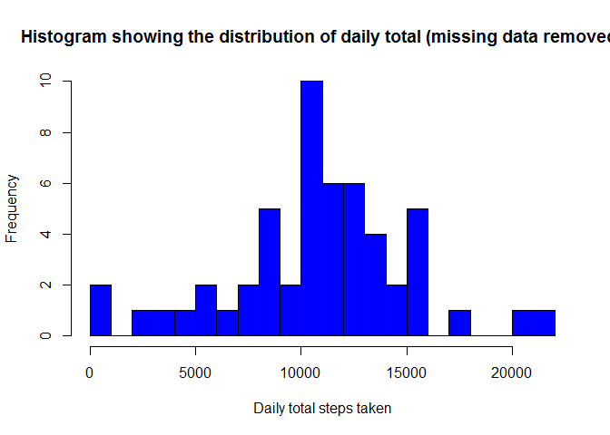
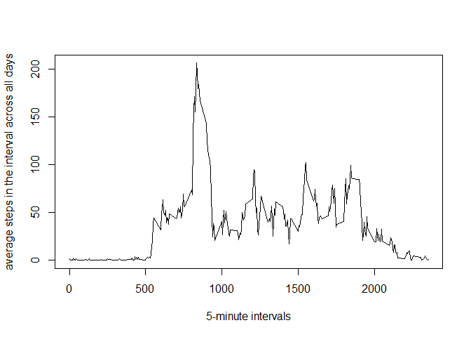

# Reproducible Research Course Project 1
Ruby Mazumdar  
January 19, 2017  
## Loading the data set Activity 


```r
setwd("C:/Users/rubymaz/Documents/GitHub/RepData_PeerAssessment1/activity")
cols = c("integer", "character", "integer")
df <- read.csv("activity.csv", head=TRUE, colClasses=cols, na.strings="NA")
head(df)
```

```
##   steps       date interval
## 1    NA 2012-10-01        0
## 2    NA 2012-10-01        5
## 3    NA 2012-10-01       10
## 4    NA 2012-10-01       15
## 5    NA 2012-10-01       20
## 6    NA 2012-10-01       25
```

## Preprocessing and Transformation
The date column is tranformed and NA variables are removed


```r
df$date <- as.Date(df$date)
df_ign <- subset(df, !is.na(df$steps))
```

## What is mean Total number of steps taken per day ?


#### Total steps per day and histogram of the distribution

```r
dailysum <- tapply(df_ign$steps, df_ign$date, sum, na.rm=TRUE, simplify=T)
dailysum <- dailysum[!is.na(dailysum)]

hist(x=dailysum,
     col="blue",
     breaks=20,
     xlab="Daily total steps taken",
     ylab="Frequency",
     main="Histogram showing the distribution of daily total (missing data removed)")
```

<!-- -->

#### Calculate the mean and median of the total number of steps taken per day
Mean

```r
mean(dailysum)
```

```
## [1] 10766.19
```

Median

```r
median(dailysum)
```

```
## [1] 10765
```
## What is the average daily activity pattern?


#### Time series plot (i.e. type = "l") of the 5-minute interval (x-axis) and the average number of steps taken, averaged across all days (y-axis)


```r
int_avg <- tapply(df_ign$steps, df_ign$interval, mean, na.rm=TRUE, simplify=T)
df_ia <- data.frame(interval=as.integer(names(int_avg)), avg=int_avg)

with(df_ia,
     plot(interval,
          avg,
          type="l",
          xlab="5-minute intervals",
          ylab="average steps in the interval across all days"))
```

<!-- -->

#### Next is to check which 5-minute interval, on average across all the days in the dataset, contains the maximum number of steps:


```r
max_steps <- max(df_ia$avg)
df_ia[df_ia$avg == max_steps, ]
```

```
##     interval      avg
## 835      835 206.1698
```

## Imputing missing values
#### total number of missing values in the dataset (i.e. the total number of rows with NAs):


```r
sum(is.na(df$steps))
```

```
## [1] 2304
```
#### For filling the missing values in the dataset, we use the mean for that 5-minute interval.
#### A new data frame df_impute is created that is equal to the original dataset but with the missing data filled in (using mean for that interval for imputation):


```r
df_impute <- df
ndx <- is.na(df_impute$steps)
int_avg <- tapply(df_ign$steps, df_ign$interval, mean, na.rm=TRUE, simplify=T)
df_impute$steps[ndx] <- int_avg[as.character(df_impute$interval[ndx])]
```
#### Make a histogram of the total number of steps taken each day and calculate and report the mean and median total number of steps taken per day.


```r
new_dailysum <- tapply(df_impute$steps, df_impute$date, sum, na.rm=TRUE, simplify=T)

hist(x=new_dailysum,
     col="blue",
     breaks=20,
     xlab="daily steps",
     ylab="frequency",
     main="The distribution of daily total (with missing data imputed)")
```

<!-- -->


```r
mean(new_dailysum)
```

```
## [1] 10766.19
```

```r
median(new_dailysum)
```

```
## [1] 10766.19
```

#### Based on the imputed data set, the new mean is 10766 and the new median is 10766 . Compare with the original mean 10766 and median 10765 , the mean doesn't change, and the median has a small change. the new median becomes identical to the mean. It could be that when we fill the missing data for the intervals, we use means for intervals, so we have more data close or identical to the means, and median is shifted and becomes identical to the mean.
####The impact of imputing missing data on the estimates of the total daily number of steps is also clear: now we have higher frquency counts in the histogram at the center region (close to the mean).

###Are there differences in activity patterns between weekdays and weekends?
####Create a new factor variable in the dataset with two levels - "weekday" and "weekend" indicating whether a given date is a weekday or weekend day


```r
# helper function to decide if a day is a week day or not
is_weekday <- function(d) {
    wd <- weekdays(d)
    ifelse (wd == "Saturday" | wd == "Sunday", "weekend", "weekday")
}

wx <- sapply(df_impute$date, is_weekday)
df_impute$wk <- as.factor(wx)
head(df_impute)
```

```
##       steps       date interval      wk
## 1 1.7169811 2012-10-01        0 weekday
## 2 0.3396226 2012-10-01        5 weekday
## 3 0.1320755 2012-10-01       10 weekday
## 4 0.1509434 2012-10-01       15 weekday
## 5 0.0754717 2012-10-01       20 weekday
## 6 2.0943396 2012-10-01       25 weekday
```
####Next we make a panel plot containing a time series plot (i.e. type = "l") of the 5-minute interval (x-axis) and the average number of steps taken, averaged across all weekday days or weekend days (y-axis).


```r
wk_df <- aggregate(steps ~ wk+interval, data=df_impute, FUN=mean)

library(lattice)
xyplot(steps ~ interval | factor(wk),
       layout = c(1, 2),
       xlab="Interval",
       ylab="Number of steps",
       type="l",
       lty=1,
       data=wk_df)
```

<!-- -->
